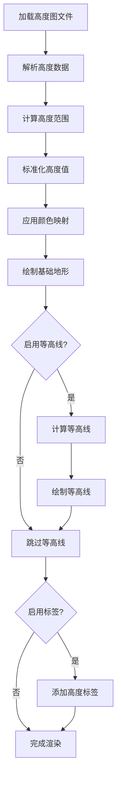

# highmap-visualizer

## HTML

# 地形扫描系统技术文档

## 1. 系统概述

地形扫描系统是一个基于Web的高度图处理工具，可将PNG/R16格式的高度图数据转换为带等高线的可视化地形图。系统采用科幻风格UI设计，提供实时渲染、多种颜色方案和批量处理功能。

### 1.1 主要特性

- **多格式支持**：支持PNG（8位灰度图）和R16（16位原始高程数据）格式
- **实时可视化**：动态渲染地形，支持等高线、网格和高度标签
- **批量处理**：支持批量转换多个高度图文件，保留原始目录结构
- **高级交互**：鼠标坐标跟踪、十字准星定位、音频反馈
- **科幻界面**：具有扫描线、网格点、边角装饰等科幻元素

## 2. 系统要求

- **浏览器**：Chrome 86+（需支持File System Access API）
- **分辨率**：建议1920×1080或更高
- **网络**：需要网络连接加载CDN资源

## 3. 使用指南

### 3.1 基本操作

#### 加载地形数据
1. 点击控制面板中的"加载地形"按钮
2. 选择PNG或R16格式的高度图文件
3. 系统将自动处理并显示地形

#### 调整显示参数
- **等高线数量**：使用滑块调整等高线密度（5-50）
- **高度缩放**：使用滑块调整高度夸张程度（0.1-3.0）
- **颜色方案**：选择不同的颜色映射方案（等离子、翠绿、炽热、涡轮）

#### 图层控制
- **网格**：显示/隐藏背景网格
- **等高线**：显示/隐藏等高线
- **高度标签**：显示/隐藏高度标注

#### 交互功能
- 鼠标移动时显示当前位置坐标和高度值
- 点击地形可创建带动画效果的十字准星标记
- 右侧数据面板实时显示地形统计信息

### 3.2 批量处理

1. 点击"批量处理"按钮
2. 选择包含多个高度图文件的目录
3. 在"输出路径"输入框中指定输出目录
4. 系统将处理所有文件并保存到指定位置
5. 处理过程中显示进度和状态信息

### 3.3 保存图像

1. 点击界面底部的"保存图片"按钮
2. 系统将以原始分辨率渲染地形并保存为PNG格式
3. 文件名格式为"terrain-scan-[时间戳].png"

## 4. 技术细节

### 4.1 渲染流程


### 4.2 颜色方案
系统提供四种预设颜色方案，每种方案对应不同的高度映射效果：
 方案名称 颜色范围 适用场景 等离子

深蓝→紫→红→黄

通用地形 翠绿

紫→蓝→绿→黄

植被覆盖区域 炽热

黑→紫→红→黄

火山/沙漠地形 涡轮

紫→蓝→绿→黄

高对比度需求
### 4.3 文件格式支持 PNG格式
- 8位灰度图，每个像素值(0-255)代表相对高度
- 自动从RGB通道提取灰度值 R16格式
- 16位原始高程数据
- 文件结构：
  - 前8字节：宽度和高度（各4字节，小端序）
  - 后续数据：每个高度点占2字节（小端序）
## 5. 常见问题
### 5.1 文件系统权限错误
问题 ：出现"获取文件系统访问权限失败，请检查浏览器权限设置"错误。

解决方案 ：

1. 确保使用Chrome 86+版本浏览器
2. 通过HTTPS或localhost访问应用
3. 在浏览器权限设置中允许网站访问文件系统
4. 如使用本地文件打开，尝试使用本地服务器（如Live Server）
### 5.2 批量处理无响应
问题 ：批量处理时界面卡顿或无响应。

解决方案 ：

1. 减少一次处理的文件数量
2. 确保每个文件大小不超过系统内存限制
3. 关闭其他内存占用大的应用程序
### 5.3 渲染质量问题
问题 ：地形渲染效果不理想或等高线不平滑。

解决方案 ：

1. 调整等高线数量滑块，找到最佳密度
2. 尝试不同的高度缩放值
3. 更换颜色方案以获得更好的视觉效果
4. 对于小分辨率高度图，可能需要先进行插值处理
## 6. 高级功能
### 6.1 自定义渲染
系统支持通过修改参数自定义渲染效果：

```javascript
// 示例：自定义等高线间隔
const customLevels = 30;
document.getElementById('contour-slider').value = customLevels;
document.getElementById('contour-value').textContent = customLevels;
contourLevels = customLevels;
renderTerrainImage();
 ```

### 6.2 键盘快捷键 快捷键 功能 Esc

移除当前十字准星 Ctrl+S

保存当前地形图像 Ctrl+R

重置视图
## 7. 技术架构
### 7.1 核心组件
- 渲染引擎 ：Canvas 2D API
- 数据处理 ：JavaScript ArrayBuffer/TypedArray
- UI框架 ：原生HTML/CSS/JavaScript
- 依赖库 ：
  - Three.js（基础3D支持）
  - D3.js（等高线计算）
  - GSAP（动画效果）
### 7.2 性能优化
- 使用TypedArray处理大型高度数据
- 离屏Canvas渲染减少重绘
- 异步处理避免UI阻塞
- 批量处理时的内存管理
## 8. 开发者信息
### 8.1 扩展开发
系统设计为模块化结构，可通过以下方式扩展功能：

1. 添加新的颜色方案 ：
   
   ```javascript
   function getColorFunction(scheme) {
     // 添加新的配色方案
     if (scheme === 'newScheme') {
       return value => ({
         r: /* 红色分量计算 */,
         g: /* 绿色分量计算 */,
         b: /* 蓝色分量计算 */
       });
     }
     // 其他现有方案...
   }
    ```
2. 支持新的文件格式 ：
   
   ```javascript
   // 在loadHeightmap函数中添加新格式支持
   if (file.name.endsWith('.newformat')) {
     // 处理新格式的代码
   }
    ```
### 8.2 API参考
系统提供以下核心函数供开发者使用：

- loadHeightmap(file) - 加载并处理高度图文件
- renderTerrainImage() - 渲染当前地形数据
- getColorFunction(scheme) - 获取指定颜色方案的映射函数
- drawContourLines(ctx) - 在指定Canvas上绘制等高线
- batchProcessFiles(fileList) - 批量处理文件列表
## 9. 更新日志
### 版本 2.0 (当前)
- 重构渲染引擎，从3D改为2D Canvas
- 添加批量处理功能
- 改进UI设计，增加科幻元素
- 添加缩略图功能
- 优化等高线渲染算法
### 版本 1.0
- 初始版本，基于Three.js的3D渲染
- 支持基本的高度图加载和显示
- 简单的颜色映射功能
## 10. 许可和致谢
### 10.1 开源组件
- Three.js - MIT许可
- D3.js - BSD许可
- GSAP - 标准许可
- Bootstrap Icons - MIT许可
### 10.2 字体
- Orbitron - SIL开源字体许可
- Noto Sans SC - SIL开源字体许可
